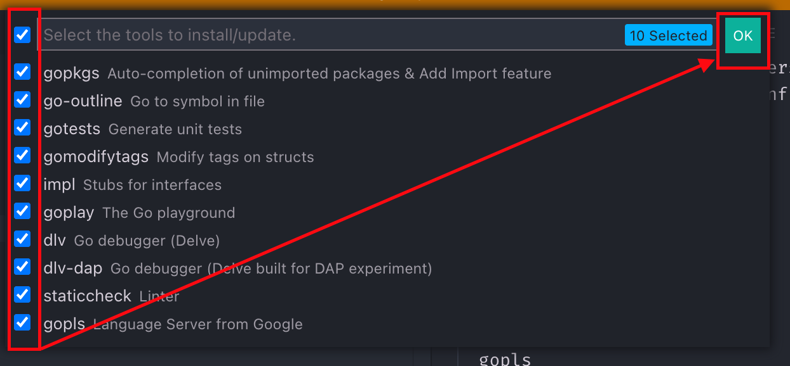
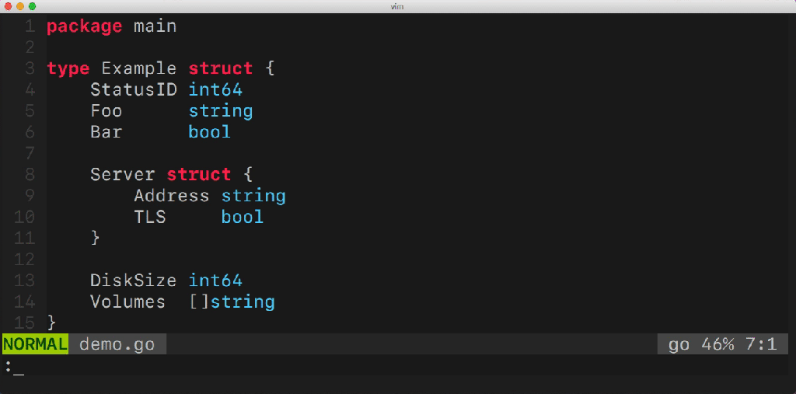

# GoLang

Own Notices from various sources.

<!-- @import "[TOC]" {cmd="toc" depthFrom=2 depthTo=4 orderedList=false} -->

<!-- code_chunk_output -->

- [Getting Started](#getting-started)
  - [Install Go via Brew](#install-go-via-brew)
  - [Uninstall Go](#uninstall-go)
  - [Go Versions Manager](#go-versions-manager)
  - [VsCode Install/Update Tools](#vscode-installupdate-tools)
- [Basics](#basics)
  - [Pre-Conditions](#pre-conditions)
  - [Hello World](#hello-world)
- [Development Environment](#development-environment)
  - [Linting & Vetting](#linting-vetting)
  - [Makefiles](#makefiles)
- [Types and Declarations](#types-and-declarations)
  - [Common Concepts](#common-concepts)
    - [Zero](#zero)
    - [var vs. `:=`](#var-vs)
    - [Explicit Type Conversion (= Automatic Type Promotion)](#explicit-type-conversion-automatic-type-promotion)
    - [Literals](#literals)
  - [Built-in Types](#built-in-types)
    - [Booleans](#booleans)
    - [Integer](#integer)
    - [Floating Point Types](#floating-point-types)
    - [Strings](#strings)
  - [Const](#const)
  - [Unused Variables & Constants](#unused-variables-constants)
  - [Naming Variables and Constants](#naming-variables-and-constants)
- [Composite Types](#composite-types)
  - [Arrays](#arrays)
  - [Slices](#slices)
    - [append (similar to push in JS)](#append-similar-to-push-in-js)
    - [Runtime Capacity](#runtime-capacity)
    - [make](#make)
    - [`nil` vs `zero` Declarations](#nil-vs-zero-declarations)
    - [Slice-slicing](#slice-slicing)
    - [Sharing Memory](#sharing-memory)
    - [Converting Array to Slices](#converting-array-to-slices)
    - [`copy` helps you to avoid memory sharing problems](#copy-helps-you-to-avoid-memory-sharing-problems)
  - [Strings, Runes, Bytes](#strings-runes-bytes)
    - [Conversion](#conversion)
    - [Strings to Slices](#strings-to-slices)
  - [Maps](#maps)
    - [With `make`](#with-make)
    - [`ok` &rarr; Comma `ok` idiom](#ok-rarr-comma-ok-idiom)
    - [Deleting](#deleting)
    - [Maps as Sets](#maps-as-sets)
  - [Structs](#structs)
    - [Anonymous Structs](#anonymous-structs)
    - [Comparing and Converting](#comparing-and-converting)
- [Scopes and Control Structures](#scopes-and-control-structures)
  - [Shadowing and detecting shadowing variables](#shadowing-and-detecting-shadowing-variables)
  - [If](#if)
  - [for - 4 different formats](#for-4-different-formats)
    - [C Style](#c-style)
    - [Condition only (like while in JS/TS)](#condition-only-like-while-in-jsts)
    - [Infinit loop with break](#infinit-loop-with-break)
    - [for range](#for-range)
  - [Switch](#switch)
  - [`goto`](#goto)
- [Functions](#functions)
  - [Simple Example](#simple-example)
  - [Simulating named and optional params](#simulating-named-and-optional-params)
  - [Variadic Input Params and Slices](#variadic-input-params-and-slices)
  - [Multiple Return Values](#multiple-return-values)
  - [Function as Values](#function-as-values)
  - [Anonymous Functions & IIFEs (like in JS/TS)](#anonymous-functions-iifes-like-in-jsts)
  - [Closures (similar to JS/TS)](#closures-similar-to-jsts)
  - [Functions as Params](#functions-as-params)
  - [Returning Functions from Functions](#returning-functions-from-functions)
  - [defer](#defer)
- [Pointers](#pointers)
  - [Pointer Type](#pointer-type)
  - [Always check for `nil`](#always-check-for-nil)
  - [`new` creates a zero value pointer](#new-creates-a-zero-value-pointer)
  - [For structs use `&` before (weird)](#for-structs-use-before-weird)
  - [With functions](#with-functions)
  - [With JSON](#with-json)
  - [Slices as Buffers](#slices-as-buffers)
- [Types](#types)
  - [Basics](#basics-1)
  - [Methods (Difference to functions)](#methods-difference-to-functions)
  - [Pointer Receivers and Value Receivers](#pointer-receivers-and-value-receivers)

<!-- /code_chunk_output -->

## Getting Started

### Install Go via Brew

```shell
brew install go
```

### Uninstall Go

Online: <https://blog.dharnitski.com/2019/04/06/uninstall-go-on-mac/>

##### If previously installed via Brew

```shell
brew uninstall dep
brew uninstall go
```

##### If previously installed via Pkgutil

```shell
pkgutil --pkgs | grep go   # find in the list
sudo pkgutil --forget org.golang.go
```

### Go Versions Manager

Online: <https://github.com/kevincobain2000/gobrew>

##### Installing

```shell
curl -sLk https://git.io/gobrew | sh -  # Installation
gobrew use 1.16.4 # Download, install and use in one step

gobrew install 1.16.4  # install only
gobrew use 1.16.4 # change to this version

go uninstall 1.16 # uninstall a certain version
```

##### ENV VARIABLES (Important for VSCode)

VSCode needs GOPATH and GOBIN to detect the currently used version, if e.g. a
package manager like gobrew is installed:

```shell
# ~/.zshrc excerpt

export PATH="$HOME/.gobrew/current/bin:$HOME/.gobrew/bin:$PATH"
export GOPATH="$HOME/.gobrew/current"
export GOBIN="$HOME/.gobrew/current/bin"
```

### VsCode Install/Update Tools

> **Notice**: You have to repeat this step if you use a go versions manager and
> and change the current version!

> Further info for VSCode: <https://github.com/golang/vscode-go/wiki/tools>

> Further General Infos: <https://pkg.go.dev/golang.org/x/tools>

1. F1 -> Go: Install/Update Tools
2. Select all and click OK



You see then in output window, something like:

```zsh

Installing 10 tools at the configured GOBIN:
  gotests
  gomodifytags
  impl
  goplay
  gopkgs
  go-outline  # within gopls in newer versions
  dlv
  dlv-dap
  staticcheck
  gopls

.. github.com/cweill/gotests/gotests@latest (..go/bin/gotests) SUCCEEDED
.. github.com/fatih/gomodifytags@latest (..go/bin/gomodifytags) SUCCEEDED
.. github.com/josharian/impl@latest (..go/bin/impl) SUCCEEDED
.. github.com/haya14busa/goplay/cmd/goplay@latest (..go/bin/goplay) SUCCEEDED
.. github.com/go-delve/delve/cmd/dlv@latest (..go/bin/dlv) SUCCEEDED
.. honnef.co/go/tools/cmd/staticcheck@latest (..go/bin/staticcheck) SUCCEEDED
.. golang.org/x/tools/gopls@v0.9.1 (..go/bin/gopls) SUCCEEDED

All tools successfully installed. You are ready to Go. :)

```

More information to the tools online:

##### Go Ppkgs

`gopkgs` is a tool that provides list of available Go packages that can be
imported. This is an alternative to `go list all`, just faster.

Online: <https://github.com/uudashr/gopkgs/>

##### Go Outline

Simple utility for extracting a JSON representation of the declarations in a Go
source file.

<https://github.com/ramya-rao-a/go-outline>

##### Go Imports

```shell
go install golang.org/x/tools/cmd/goimports@latest
```

##### Go Tests

`gotests` makes writing Go tests easy. It's a Golang commandline tool that
generates table driven tests based on its target source files' function and
method signatures. Any new dependencies in the test files are automatically
imported.

<https://github.com/cweill/gotests/>

##### Go Modify Tags

Go tool to modify/update field tags in structs. `gomodifytags` makes it easy to
update, add or delete the tags in a struct field. You can easily add new tags,
update existing tags (such as appending a new key, i.e: db, xml, etc..) or
remove existing tags. It also allows you to add and remove tag options. It's
intended to be used by an editor, but also has modes to run it from the
terminal. Read the usage section below for more information.



<https://www.github.com/fatih/gomodifytags>

##### Go Impl

`impl` generates method stubs for implementing an interface.

```go
$ impl 'f *File' io.ReadWriteCloser
func (f *File) Read(p []byte) (n int, err error) {
	panic("not implemented")
}

func (f *File) Write(p []byte) (n int, err error) {
	panic("not implemented")
}

func (f *File) Close() error {
	panic("not implemented")
}

# You can also provide a full name by specifying the package path.
# This helps in cases where the interface can't be guessed
# just from the package name and interface name.
$ impl 's *Source' golang.org/x/oauth2.TokenSource
func (s *Source) Token() (*oauth2.Token, error) {
    panic("not implemented")
}
```

<https://www.github.com/josharian/impl>

##### Go Play Ground Client

```shell
goplay some-example.go # opens browser
```

<https://www.github.com/haya14busa/goplay/>

##### Go Delve

A Debugger for the Go Programming Language

GitHub: <https://www.github.com/go-delve/delve/> Getting Started:
<https://github.com/go-delve/delve/blob/master/Documentation/cli/getting_started.md>

##### Go Tools from Dominik Honnef: Go `staticcheck`

`Staticcheck` is a state of the art linter for the Go programming language.
Using static analysis, it finds bugs and performance issues, offers
simplifications, and enforces style rules.

GitHub: <https://github.com/dominikh/go-tools> Online Documentation:
<https://staticcheck.io/docs/>

##### gopls, the Go Language Server

> MacOS: XCode and Command Line Tools may be necessary

`gopls` (pronounced "Go please") is the official Go language server developed by
the Go team. It provides IDE features to any LSP-compatible editor.

You should not need to interact with gopls directly--it will be automatically
integrated into your editor.

<https://pkg.go.dev/golang.org/x/tools/gopls>

<https://www.golang.org/x/tools/gopls>

## Basics

### Pre-Conditions

1. You have installed go and registered necessary PATHs in your shell
   configuration, e.g:

```shell
PATH="/usr/local/sbin:$PATH"
PATH="$HOME/.gobrew/current/bin:$HOME/.gobrew/bin:$PATH"
export GOPATH="$HOME/go"
PATH="$GOPATH/bin:$PATH"
```

If you want to use private packages and bypass proxy & co:

```shell
export GOPRIVATE=example.com/*,example2.com/*,ex3.com/whatever
export GONOSUMDB=example.com/*,example2.com/*,ex3.com/whatever
export GONOPROXY=example.com/*,example2.com/*,ex3.com/whatever
```

2. Choose your workspace within your path, e.g:

```shell
mkdir $GOPATH/src/MyGoProject/
cd    $GOPATH/src/MyGoProject/
```

3. Initialise Module and Create a Main File

```shell
go mod init
touch main.go
```

### Hello World

A complete program is created by linking a single, unimported package called the
`main package` with all the packages it imports, transitively. The main package
must have package name main and `declare a function main` that takes no
arguments and returns no value.

```go
// main.go

package main

import "fmt"

func main() {
  fmt.Println(("Hello World"))
}
```

```shell
go run main.go    # Runs directly without building
go build          # Works if there is a module
go build main.go  # or so
./main.go         # prints Hello World or
./MyGoProject      # the same like above
```

At this time you have the following files in your workspace:

```shell
MyGoProject       # Executable (created by `go build` without file name)
go.mod           # Text File, e.g. ModuleName and used Go Version etc.
main             # Executable (created by `go build main.go`)
main.go          # Source File
```

That's the `go.mod`

```go
module MyGoProject

go 1.17
```

You can also use your GitHub repo as a module like:

```shell
go mod init github.com/webia1/my-go-project
```

## Development Environment

### Linting & Vetting

`golint` lints the Go source files named on its command line.

```shell
go install golang.org/x/lint/golint@latest
go lint ./...           # 3 DOTS
```

`vet` examines Go source code and reports suspicious constructs, such as Printf
calls whose arguments do not align with the format string. Vet uses heuristics
that do not guarantee all reports are genuine problems, but it can find errors
not caught by the compilers.

Vet is normally invoked through the go command. This command vets the package in
the current directory (no installation required):

```shell
go vet                    # or
go vet my/project/...     # or
go vet ./...              # 3 DOTS!
```

`golangci-lint` combines `golint` and `go wet`, it runs linters in parallel,
uses caching, supports yaml config, has integrations with all major IDE and has
dozens of linters included. (Documentation: <https://golangci-lint.run/>)

```shell
brew install golangci-lint

```

`Staticcheck` is a state of the art linter for the Go programming language.
Using static analysis, it finds bugs and performance issues, offers
simplifications, and enforces style rules. <https://staticcheck.io/>.
Configuration: <https://staticcheck.io/docs/configuration/>. (Installed by
VSCode Tools or see below).

```shell
go install honnef.co/go/tools/cmd/staticcheck@latest
```

### Makefiles

> **Makefiles for Go Developers**:
> <https://tutorialedge.net/golang/makefiles-for-go-developers/>

Go developers have adopted `make` as their solution (save as `Makefile`):

```Makefile
.DEFAULT_GOAL := build

fmt:
    go fmt ./...
.PHONY:fmt          # <-- Self chosen name for `fmt` part

lint: fmt            # <-- `fmt` is the pre-condition for `lint`
    golint ./...
.PHONY:lint

vet: fmt
    go vet ./...
.PHONY:vet
```

**Makefiles are extremely picky:** You must indent the steps in a target with a
`tab`.

> A **`PHONY`** target is one that is not really the name of a file; rather it
> is just a name for a recipe to be executed when you make an explicit request.
> There are two reasons to use a phony target: to avoid a conflict with a file
> of the same name, and to improve performance.

Once the `Makefile` is in the `"src"` directory (any name can be chosen), type:

```shell
make
```

## Types and Declarations

### Common Concepts

#### Zero

Variable is declared but not assigned a value. (Like `null` in JS)

#### var vs. `:=`

```go
var x int = 10          // is the same like
var x = 10              // because it is assigned, no need for type
x := 10                 // is the same like the two declarations above
var x int               // something like "let x: int = null" in TS
var x, y int = 10, 20   // more than one declarations
var x, y int            // with zero values
var x, y = 10, "Hi"     // with different types
x, y := 10, "Hi"        // same like above

// also a "declaration list" would be possible

var (
  a     int
  b           = 20
  c     int   = 30
  d, e        = 40, "Hi"
  f, g  string
)
```

The `:=` operator can reassign (not possible by using `var`):

```go
x     := 10
x, y  := 30, "Hi"
```

One limitation for `:=`: At package level you must use var because it is not
legal outside of functions.

**Important notices:**

- Initialisation with zero values -> better `var` than `:=`
- prefer something like `var x byte = 20` to `x := byte(20)`
- `:=` allows you to reassign too. Attention: &rarr; `Shadowing Variables`

_**As a general rule: Declare variables in the package block that are
effectively immutable.**_

#### Explicit Type Conversion (= Automatic Type Promotion)

Go doesn't allow automatic type conversion, when variable types do not match.

#### Literals

- Integer Literals, based on 10, except:
  - `Ob` binary
  - `Oo` octal (0 with no letter after it is octal too, but don't use it)
  - `0x` hexadecimal
- Floating Point Literal
  - e.g. 7.11e23
  - `0x` hexadecimal
  - `p` exponent
  - `_` formatting big numbers
- Rune Literals (Chars in JS)

  - e.g. `('a')`, `('\171')`, `('\x47')`
  - 16 Bit Hexadecimal `('\u0061')`
  - 32 Bit Unicode `('\U00000061')`
  - Newline `('\n')`
  - Tabulator `('\t')`
  - Octal (rare)

- String Literals (very similar to JS)
  - Double Quotes
    - `"Hello World"`
    - `"My \"Hello World\""` If double quotes within -> escape them
  - or Backtick (also called Backquotes)
    - In this case, you don't have to escape double quotes within strings:
    - `` `My "Hello World"` ``

### Built-in Types

- boolean: `bool`
- integer
- float
- string

#### Booleans

```go
var myFlag bool       // no value assigned -> false
var myFlag = true     // it is bool and true
```

#### Integer

`NaN` -> Similar to JS

> **Important:** If you assign a type and then use a number **larger than the
> types range** to assign it, **it will fail**.

> If you convert to a type that has range lower than your current range, **data
> loss will occur**.

Special name `byte` is an alias for `uint8`, and the other special name `int` is
CPU dependent (e.g. int32 or int64).

> There are some uncommon 64Bit CPU architectures with 32 bit signed integer: Go
> supports: `amd64p32`, `mip64p32`, and `mips64p32le`

> Go does not have generics and function overloadings (yet?).

Source: <https://gosamples.dev/int-min-max/>

To get the maximum and minimum value of various integer types in Go, use the
[`math`](https://pkg.go.dev/math) package constants. For example, to get the
minimum value of the `int64` type, which is **\-9223372036854775808**, use the
[`math.MinInt64`](https://pkg.go.dev/math#pkg-constants) constant. To get the
maximum value of the `int64` type, which is **9223372036854775807**, use the
[`math.MaxInt64`](https://pkg.go.dev/math#pkg-constants). To check the minimum
and maximum values of different int types, see the following example and its
output.

> For unsigned integer types, only the max constant is available because the
> minimum value of unsigned types is always 0.

##### Signed integers in Go

Source: <https://golangdocs.com/integers-in-golang>

Signed integer types supported by Go is shown below.

```go
int8    // is -128 to 127
int16   // is -32768 to 32767
int32   // is -2147483648 to 2147483647
int64   // is -9223372036854775808 to 9223372036854775807
```

##### Unsigned integers in Go

```go
uint8   // 0 to 255
uint16  // 0 to 65535
uint32  // is 0 to 4294967295
uint64  // 0 to 18446744073709551615
```

##### Type Conversion

We do typecast by directly using the name of the variable as a function to
convert types:

```go
package main

import ("fmt")

func main() {
    var x int32
    var y uint32     // range 0 to 4294967295
    var z uint8      // range 0 to 255
    fmt.Println("Type Conversion")
    x = 26700
    y = uint32(x)       // data preserved because number is inside range
    z = uint8(x)        // data loss due to out of range conversion
    fmt.Println(y, z)   // prints 26700 76
}
```

##### Integer Operations

- `+, -, *, /, % for modulus` Division by 0 causes so called `panic`
- `==, !=, >, >=, <, <=` Comparisons
- `<<, >>, &, |, ^, &^ ` Bit Manipulations (^ = XOR, &^ = AND NOT)

#### Floating Point Types

Go supports the `IEEE-754` 32-bit and 64-bit floating-point numbers. You can use
all standard number operators with floats except `%`.

IEEEE-754: <https://en.wikipedia.org/wiki/IEEE_754>

> **Do not use them to represent money or whatever needs to have an exact
> decimal representation**

```go
float32
float64
```

Source: https://gosamples.dev/float64-min-max/

The maximum value of the `float64` type in Go is
**1.79769313486231570814527423731704356798070e+308** and you can get this value
using the [`math.MaxFloat64`](https://pkg.go.dev/math#pkg-constants) constant.

The minimum value above zero (smallest positive, non-zero value) of the
`float64` type in Go is **4.9406564584124654417656879286822137236505980e-324**
and you can get this value using the
[`math.SmallestNonzeroFloat64`](https://pkg.go.dev/math#pkg-constants) constant.

The maximum value of the `float32` type in Go is
**3.40282346638528859811704183484516925440e+38** and you can get this value
using the [`math.MaxFloat32`](https://pkg.go.dev/math#pkg-constants) constant.

The minimum value above zero (smallest positive, non-zero value) of the
`float32` type in Go is **1.401298464324817070923729583289916131280e-45** and
you can get this value using the
[`math.SmallestNonzeroFloat32`](https://pkg.go.dev/math#pkg-constants) constant.

##### Type Conversion

Loss of precision will occur when a 64-bit floating-point number is converted to
32-bit float.

Source: <https://golangdocs.com/floating-point-numbers-in-golang>

```go
package main

import (
    "fmt"
)

func main() {
    var f1 float32
    var f2 float64

    f2 = 1.234567890123
    f1 = float32(f2)

    fmt.Println(f1)         // prints "1.2345679"
}
```

##### Complex Numbers

Floating-point numbers are used in complex numbers as well. The real and
imaginary parts are floats.

More information: <https://golangdocs.com/complex-numbers-in-golang>

```go
package main

import (
	"fmt"
	"math/cmplx"
)

func main() {
	x := complex(2.5, 3.1)
	y := complex(10.2, 2)
	fmt.Println(x + y)
	fmt.Println(x - y)
	fmt.Println(x * y)
	fmt.Println(x / y)
	fmt.Println(real(x))
	fmt.Println(imag(x))
	fmt.Println(cmplx.Abs(x))
}

```

##### Matrix (Matrizen)

No matrix support :/

#### Strings

Similar to JS. `Zero value` is empty string.

### Const

Very similar to TS. Constants can be typed or untyped.

If constants are untyped e.g. the following is allowed:

```go
// it is a number but there is no specific type
const x = 10;

// therefore the following assignments are OK
var a int = x       // OK
var b float64 = x   // OK
var c byte = x      // OK
```

But if you give a type to it, you have to consider:

```go
// it is an integer
const x int = 10;
var a int = x       // OK
var b float64 = x   // not OK because int != float
```

### Unused Variables & Constants

Every declared local variable must be read. It is a compile-time error to
declare a local variable and to not read its value.

But the compiler's unused-variable-check is not precise enough; it accepts a
single read, even if there were writes afterwards, same with `go vet`. But
`golangci-lint` can detect them.

The Go compiler does not prevent you from creating unread
package-level-variables.

Suprisingly: Unused constants are OK :)

### Naming Variables and Constants

Very similar to JS/TS, any Unicode (letter/digit) is allowed. See other parts
above (e.g. begining with digit).

`_` is a valid character but Go prefers `camelCase` instead of `snake_case`.

> And undercore `_` by itself is a special identifier name in Go (ignoring a
> parameter, or prop etc., see examples in the coming sections).

Preferred Go Style (as short as possible within block code):

- k, v &rarr; key, value
- i, j &rarr; common names for index variables

## Composite Types

### Arrays

> Completely different than arrays in JS/TS

Confusing definition (By Jon Bodner): "All of the elements in the array must be
of the type that's specified but this does not mean they are always of the same
type". Another quote: **Don't use arrays unless you know the exact length you
need ahead of time.**

```go
var x [3]int                // 3 is the size of the array
                            // No values specified, i.e -> x = [0,0,0]
                            // Zero value for int is 0

var x = [3]int{10, 20, 30} // Values set


// Here is a so called sparse array :)

var x = [8]int{1, 3: 7, 5, 6: 8, 9}  // [1 0 0 7 5 0 8 9]

/**
  First value (index 0) is 1,
  7 is index no 3 (the next one, has the next index no)
  5 is index no 4,
  8 is index no 6 and so on, that means
  9 is the index no 7
  everything else is 0
*/

// You can also leave off number by using `...`

var x = [...]int{1, 2, 3}

x[0] = 10
fmt.Println(x)       // [10 2 3]
fmt.Println(len(x))  // 3

// Simulating more dimensional arrays:
// 2 arrays of length 3 with zero values

var x [2][3]int  // [[0 0 0] [0 0 0]]  -> How to modify them, see link below:

```

See more about: <https://codezup.com/arrays-in-golang-multi-dimensional-arrays/>

### Slices

> Slices looks like arrays with some differences (notice the missing `...`).

> **Zero value for a slice** is **`nil`** (and not `0`).

> (To my mind: Zero is something like `null` in JS, `nil` is like `undefined`)

```go
var x = [...]int{1, 2, 3}               // --> ARRAY
var x = []int{1, 2, 3}                  // --> SLICE

var x = [8]int{1, 3: 7, 5, 6: 8, 9}     // --> ARRAY
var x = []int{1, 3: 7, 5, 6: 8, 9}      // --> SLICE

var x [2][3]int                         // --> ARRAY
var x [][]int                           // --> SLICE
```

**The only thing you can compare a slice with is `nil`.** The `reflect package`
contains a function calles `DeepEqual` can compare almost anything, including
slices.

```go
var x []int
fmt.Println (x == nil) // true
```

#### append (similar to push in JS)

`...` like spread operator in JS but different syntax (postfix instead of
prefix).

> It is a compile-time error if you forget to assign the value returned from
> append. (Go is a **`call by value`** language &rarr; no object references like
> in JS, but real copies)

```go
var x = []int{1, 2, 3}
x = append(x, 10)         // [1 2 3 10]
x = append(x, 5, 7, 9)    // [1 2 3 10 5 7 9]
y := []int{20, 30, 40}
x = append(x, y...)       // [1 2 3 10 5 7 9 20 30 40]

```

#### Runtime Capacity

Runtime capacity is like in C++:

> The rules as of Go 1.14 are to double the size of the slice when the capacity
> is less than 1,024 and then grow by at least 25% afterward.

Just as the built-in **`len`** function returns the current length of a slice,
the built-in **`cap`** function returns the current capacity of a slice. It is
used far less frequently than len.

Cap is typically used to determine whether a slice is big enough to accommodate
new data or whether a call to make is required to create a new slice.

> The cap function also accepts an array as a parameter, although for arrays,
> cap always returns the same value as len.

```go
var x []int
fmt.Println(x, len(x), cap(x))
x = append(x, 10)
fmt.Println(x, len(x), cap(x))
x = append(x, 11)
fmt.Println(x, len(x), cap(x))
x = append(x, 12)
fmt.Println(x, len(x), cap(x))
x = append(x, 13)
fmt.Println(x, len(x), cap(x))
x = append(x, 14)
fmt.Println(x, len(x), cap(x))
```

**outputs:**

```shell
[] 0 0
[10] 1 1
[10 11] 2 2
[10 11 12] 3 4
[10 11 12 13] 4 4
[10 11 12 13 14] 5 8
```

#### make

The built-in `make` function is responsible for creating an empty slice with a
specified length or capacity.

> Your program will panic at runtime if you use a variable to set a capacity
> that is less than the length.

```go
x := make([]int, 5)         // length of 5 and a capacity of 5.
x := make([]int, 5, 10)     // length of 5 and a capacity of 10.


/** The following is tricky:
We cannot directly index into it because it has length 0,
but we can append values to it instead:
*/

x := make([]int, 0, 10)     // length of 0 and a capacity of 10.
x = append(x, 1, 3, 7)

```

A slice's length always increases after an `append`! Make sure that you set the
slice's length before using the `make`; otherwise, your slice may start off with
a surprising number of zero values.

#### `nil` vs `zero` Declarations

```go

// import fmt and reflect before

var data []int            // nil slice declaration
var data  = []int{}       // empty slice with zero-length

var x []int
var y = []int{}

fmt.Println(x, len(x))	  // [] 0  Debugger:  []int len: 0, cap: 0, nil
fmt.Println(y, len(y))	  // [] 0  Debugger:  []int len: 0, cap: 0, []

fmt.Println(x == nil)     // true
fmt.Println(y == nil)     // false

fmt.Println(reflect.TypeOf(x))                      // []int
fmt.Println(reflect.TypeOf(y))                      // []int
fmt.Println(reflect.TypeOf(y) == reflect.TypeOf(x)) // true

fmt.Println(reflect.ValueOf(x).Kind()) // slice
fmt.Println(reflect.ValueOf(y).Kind()) // slice

/**
  You cannot compare x == y
  invalid operation: cannot compare x == y
  (var x []int -> slice can only be compared to nil)
  compilerUndefinedOp
*/

// It is possible to create an int slice
// with zero length but greater capacity:

z := make([]int, 0, 10)		// Debugger: []int len: 0, cap: 10, []
fmt.Println(z, len(z), cap(z))  // [] 0 10

/**
Since its length is 0, we cannot directly
index into it, but we can append values to it:
*/

z := make([]int, 0, 10)
z = append(x,3,5,7); // []int len: 3, cap: 3, [3,5,7]

Same with nil-able declarations:

var v []int             // []]int len: 0, cap: 0, nil
v = append(v, 3, 5, 7)  // []int len: 3, cap: 3, [3,5,7]

```

Use `make` if you roughly know how big your slice needs to be but don't know
what values it will get.

The question is:

- whether you should specify a `nonzero length` or
- a `zero-length and a nonzero capacity` in the call to make.

There are three alternatives:

1. Slice as buffer &rarr; nonzero length
2. You know the size &rarr; specity the length and index into it. But if the set
   size was not big enough, you will get `panic`.
3. Or specify zero length, nonzero capacity and append to it. If the real size
   is smaller then there will be zero values at the end of the slice, if larger,
   your code will not panic.

#### Slice-slicing

See the following `slice expressions` that creates a slice form a slice:

```go
//            0  1  2  3  4
var x = []int{2, 3, 5, 7, 9}
var a = x[:3]   // 0 (incl) till 3 (excl) -> [2 3 5]
var b = x[2:]   // 2 (incl) till end  -> [5 7 9]
var c = x[1:4]  // 1 (incl) till 4 (excl)  -> [3 5 7]
var d = x[:] // all -> [2 3 5 7 9]
```

#### Sharing Memory

Important: Slices are not copies, they are references.

```go
var x = []int{2, 3, 5, 7, 9}
var b = x[0:2]
x[0] = 100

fmt.Println(x)  // [100 3 5 7 9]
fmt.Println(b)  // [100 3]
```

Many funny things happen:

```go
var x = []int{2, 3, 5, 7, 9}
var b = x[:2]

fmt.Println(cap(x), cap(b))   // 5 5

x[0] = 100
b = append(b, 30)

fmt.Println("x:", x)    // x: [100 3 30 7 9]
fmt.Println("b:", b)    // b: [100 3 30]
```

A more confusing example:

> Never `append` to a `slice` if you want to avoid surprises, or use the trick
> (third parameter with position) after the example below.

```go
x := make([]int, 0, 10)
x = append(x, 3, 5, 7, 9)
b := x[:2]
c := x[2:]

fmt.Println("x:", x)        // x: [3 5 7 9]
fmt.Println("b:", b)        // b: [3 5]
fmt.Println("c:", c)        // c: [7 9]

b = append(b, 20, 30, 40)
x = append(x, 11)
c = append(c, 13)

fmt.Println("x:", x)        // x: [3 5 20 30 13]
fmt.Println("b:", b)        // b: [3 5 20 30 13]
fmt.Println("c:", c)        // c: [20 30 13]
```

Notice the 3rd parameter in the slide expression: We limit the capacity of the
subslices to their length.

```go
x := make([]int, 0, 10)
x = append(x, 3, 5, 7, 9)

b := x[:2:2]          // <-- 3rd parameter
c := x[2:4:4]         // <-- 3rd parameter

fmt.Println("x:", x)  // x: [3 5 7 9]
fmt.Println("b:", b)  // b: [3 5]
fmt.Println("c:", c)  // c: [7 9]

b = append(b, 20, 30, 40)
x = append(x, 11)
c = append(c, 13)

fmt.Println("x:", x)  // x: [3 5 7 9 11]
fmt.Println("b:", b)  // b: [3 5 20 30 40]
fmt.Println("c:", c)  // c: [7 9 13]
```

#### Converting Array to Slices

You can take a slice from an Array too (same problems - memory sharing - see
above, using third parameter helps here too).

```go
x := [5]int{1, 3, 5, 7, 9}
b := x[:2:2]
c := x[2:4:4]

fmt.Println("x:", x)          // x: [1 3 5 7 9]
fmt.Println("b:", b)          // b: [1 3]
fmt.Println("c:", c)          // c: [5 7]

b = append(b, 20, 30, 40)
//	x = append(x, 11)  // you cannot append to an array
c = append(c, 13)

fmt.Println("x:", x)          // x: [1 3 5 7 9]
fmt.Println("b:", b)          // b: [1 3 20 30 40]
fmt.Println("c:", c)          // c: [5 7 13]
```

without the 3rd param you will get surprising results (like it is the case with
slices). The same example above this time without the 3rd param:

```go
x := [5]int{1, 3, 5, 7, 9}
b := x[:2]
c := x[2:4]

fmt.Println("x:", x)            // x: [1 3 5 7 9]
fmt.Println("b:", b)            // b: [1 3]
fmt.Println("c:", c)            // c: [5 7]

b = append(b, 20, 30, 40)
//	x = append(x, 11)  // you cannot append to an array
c = append(c, 13)

fmt.Println("x:", x)            // x: [1 3 20 30 13]
fmt.Println("b:", b)            // b: [1 3 20 30 13]
fmt.Println("c:", c)            // c: [20 30 13]
```

#### `copy` helps you to avoid memory sharing problems

##### Same size:

```go
a := []int{1, 3, 5, 7, 9}
b := make([]int, 5)

x := copy(b, a)         // (destination <- source)

fmt.Println("a:", a)    // a: [1 3 5 7 9] source
fmt.Println("b:", b)    // b: [1 3 5 7 9] destination
fmt.Println("x:", x)    // x: 5 (number of copied elems)
```

##### Smaller size: from the beginning of source array

```go
a := []int{1, 3, 5, 7, 9}
b := make([]int, 2)

x := copy(b, a)

fmt.Println("a:", a)    // a: [1 3 5 7 9] source
fmt.Println("b:", b)    // b: [1 3] destination
fmt.Println("x:", x)    // x: 2 (number of copied elems)
```

##### Bigger size: zero values at the end

```go
a := []int{1, 3, 5, 7, 9}
b := make([]int, 7)

x := copy(b, a)

fmt.Println("a:", a)    // a: [1 3 5 7 9] source
fmt.Println("b:", b)    // b: [1 3 5 7 9 0 0] destination
fmt.Println("x:", x)    // x: 5 (number of copied elems)
```

##### From anywhere of the source slice

```go
a := []int{1, 3, 5, 7, 9}
b := make([]int, 2)

x := copy(b, a[3:])

fmt.Println("a:", a)    // a: [1 3 5 7 9]
fmt.Println("b:", b)    // b: [7 9]
fmt.Println("x:", x)    // x: 2
```

##### From overlapping sections of the source slice to the source slice (copy and replace within)

Try out to explain it :)

```go
a := []int{1, 3, 5, 7, 9, 11, 13}

x := copy(a[:3], a[3:])

fmt.Println("a:", a)  // a: [7 9 11 7 9 11 13]
fmt.Println("x:", x)  // x: 3
```

Explanation:

```text
1  3  5  replace with 7 9 11 13
different size therefore sub-result => 7 9 11

0  1  2  3  4  5  6
1  3  5  7  9  11 13
7  9  11 7  9  11 13  <- result
```

Second Example:

```go
a := []int{1, 3, 5, 7, 9, 11, 13}

x := copy(a[4:], a[1:4])

fmt.Println("a:", a) // [1 3 5 7 3 5 7]
fmt.Println("x:", x) // 3
```

### Strings, Runes, Bytes

Strings (re-assignable but immutable) have no capacity only length, written
within double quotes. Runes has no length, written within single quotes.

```go
str := "Hello World 🫢"
r := 'h'

fmt.Println(str, len(str), r, string(r))
// Hello World 11 104 h
```

```go
var a string = "Hi there"
var b byte = a[6]
var x string = a[3:]

fmt.Println(a, b, x) // Hi there 114 there
```

#### Conversion

In general: Take care of the length!

```go
str := "Oh 🫢"        // Smiley is 4 bytes
fmt.Println(len(str)) // 7
```

#### Strings to Slices

> Slices of runes -> uncommon

```go
var str string = "Oh 🫢"
var x []byte = []byte(str)
var y []rune = []rune(str)
fmt.Println(x, y)

  // outputs
  // [79 104 32 240 159 171 162] [79 104 32 129762]

  // UTF8: little-endian versus big-endian -> no problems here

```

### Maps

The zero value for a `map` is `nil`. Maps are not comparable. You can only check
if they are equal to `nil`.

`len` is OK. Key can be any comparable type.

`map[keyType]valueType:`

If we want to read a value of a non-existing key, we get its zero value (e.g. if
`int` &rarr; 0).

> you can use ++ increment operator to increment the numeric value for a map
> key. (&rarr; Example)

```go
var myFirstMap = map[string]int{
  "foo": 0,  // Attention: Comma is always required
}

var mySecondMap = map[string][]string{
  "foo": {"one", "two"},
  "bar": {"one", "two", "three"}, // Attention: Comma required
}

fmt.Println(myFirstMap, mySecondMap)
// map[foo:0] map[bar:[one two three] foo:[one two]]
```

#### With `make`

```go
	myMap1 := make(map[int][]string, 10)
	myMap2 := make(map[string]int, 10)

	myMap1[13] = []string{"Hi", "there"}
	myMap2["foo"] = 4716

	fmt.Println(myMap1, myMap2)

  // map[13:[Hi there]]
  // map[foo:4716]

```

#### `ok` &rarr; Comma `ok` idiom

It can be any literal, must not be `ok` only.

```go
myMap1 := map[string]int{
  "foo": 7,
  "bar": 11,
}

value, ok := myMap1["foo"]
fmt.Println(myMap1, value, ok)

value, ok = myMap1["bar"]
fmt.Println(myMap1, value, ok)

value, ok = myMap1["what"]
fmt.Println(myMap1, value, ok)

// outputs
// map[bar:11 foo:7] 7 true
// map[bar:11 foo:7] 11 true
// map[bar:11 foo:7] 0 false

```

#### Deleting

Delete function does not return a value!!

```go
myMap1 := map[string]int{
  "foo": 7,
  "bar": 11,
  "baz": 2014,
}

delete(myMap1, "baz")

fmt.Println(myMap1) // map[bar:11 foo:7]
```

#### Maps as Sets

You can use maps as sets because maps because you cannot have duplicate keys in
a map.

```go
myMap1 := map[int]bool{}
myValues := []int{7, 1, 2, 3, 3, 2, 2, 2, 7}

for _, v := range myValues {
  myMap1[v] = true
}

fmt.Println(myMap1, myMap1[11])
// map[1:true 2:true 3:true 7:true]
// false
```

##### Using `structs` as values within a `set`

- `ok` is a local variable
- `_` is a convention means ignore first return value (value)

see Comma `ok` idiom above

```go
// weird constellation for JS/TS-Devs :)
intSet := map[int]struct{}{}
vals := []int{1, 2, 2, 2, 3}
for _, v := range vals {
	intSet[v] = struct{}{}
}

if _, ok := intSet[3]; ok {
	fmt.Println("3 is in the set")
}

fmt.Println("Before Programm End")
```

### Structs

- Syntax like interfaces in JS/TS.
- If they are defined wihtin a function, they can only be used in that function.
- `.` Dot Notation

```go
type person struct {
	name string
	age  int
}

p1 := person{}
p1.name = "Michael"
p1.age = 55

p2 := person{
	name: "George",
	age:  56,
}

// if so all of them required
p3 := person{"Rita", 66}

// if so, age will be set to its zero value
p4 := person{
	name: "Aretha",
}

fmt.Println(p1, p2, p3, p4)
// {Michael 55} {George 56} {Rita 66} {Aretha 0}
```

#### Anonymous Structs

```go
person := struct {
	name string
	age  int
}{
	name: "George Michael",
	age:  56,
}

fmt.Println(person)
{George Michael 56}
```

#### Comparing and Converting

Comparing

- possible if
  - composed of comparable types
- not possible if
  - slice/map fields
  - different types/order/props

Anonymous Structs can be compared

- if same props/order/types

Type conversion is possible only

- if same props/order/types

## Scopes and Control Structures

### Shadowing and detecting shadowing variables

- Shadowing is similar to in JS/TS

Detecting:

```shell
go install golang.org/x/tools/go/analysis/passes/shadow/cmd/shadow@latest
```

If you use a `Makefile`:

```makefile
vet:
  go vet ./...
  shadow ./...
.PHONY:vet
```

Go hat a so called `universe block` with so called `predeclared identifiers`.
Dedection within is `universe block` is difficult and not covered by most
linters incl. the one above.

### If

If can have its block variables like:

```go

// rand must be configured -> rand.Seed

rand.Seed(time.Now().UnixNano())

if n := rand.Intn(10); n == 0 {
  fmt.Println("It is zero", n)
} else {
  fmt.Println("Not zero", n)
}

```

### for - 4 different formats

- `for` is only looping key word in Go.
- `break` or `continue` (=skip) are allowed
- labeling possible
  - with `labelName:`
  - in a seperate line above `for`
  - then within a `for` e.g. `continue labelName`

#### C Style

You must use `:=` because `var` is not allowed here

```go
for i :=0; i < 10; i++ {
  // ...
}
```

#### Condition only (like while in JS/TS)

```go
i := 0
for i < 100 {
  // ...
}
```

#### Infinit loop with break

```go
for {
  // ....
  if whatEver {
    break
  }
}
```

#### for range

##### In General

Idiomatic:

- `i,v` index/value (arr/slice/string) or
- `k,v` key/value (maps/..)
- for-range value is a copy

```go
somePrimNumbers := []int{2, 3, 5, 7, 9}
for index, value := range somePrimNumbers {
  fmt.Println(index, value)
}
```

##### Ignoring Index

```go
somePrimNumbers := []int{2, 3, 5, 7, 9}
for _, v := range somePrimNumbers {
  fmt.Println(v)
}
```

##### Range in a set (key only example)

```go
	someMapAsSet := map[string]bool{
  "George":   true,
  "Michael":  true,
  "Aretha":   true,
}

for k := range someMapAsSet {
  fmt.Println(k)
}
```

##### Iterating over maps

Order is always different, but fmt.Println sorts keys in ascending order.

```go
m := map[string]int{
  "one":   1,
  "two":   2,
  "three": 3,
}

for i := 0; i < 3; i++ {
  fmt.Println("Iteration no", i+1)
  for k, v := range m {
    fmt.Println(k, v)
  }
}
```

##### Iterating over Strings

```go
str := "Hi There"

for i, v := range str {
  fmt.Println(i, string(v))
}

// 0 H
// 1 i
// 2
// 3 T
// 4 h
// 5 e
// 6 r
// 7 e

```

##### Iterating over String Slices

```go
str := []string{"Hi", "there"}

for i, v := range str {
  fmt.Println(i, v)
}

// 0 Hi
// 1 there
```

##### Using for-range like a arr.forEach in JS/TS

```go

initialValues := []int{1, 2, 3}
doubles := []int{}

for _, v := range initialValues {
	doubles = append(doubles, v*2)
}

fmt.Println(initialValues) // [1 2 3]
fmt.Println(doubles) // [2 4 6]

```

##### Nested for-range loops with labels

No skipped values:

```go
	initialValues := [][]int{{1, 2, 3}, {2, 4, 6}}

myLabelLevel0:
	for i, level0Val := range initialValues {
		for _, level1Val := range level0Val {
			if level1Val == 11 {
				continue myLabelLevel0
			}
		}
		fmt.Println("Iteration", i+1, "Level 1: No values skipped")
	}

// Iteration 1 Level 1: No values skipped
// Iteration 2 Level 1: No values skipped
```

Skipped Values:

```go
	initialValues := [][]int{{1, 2, 3}, {2, 4, 6}}

myLabelLevel0:
	for i, level0Val := range initialValues {
		for _, level1Val := range level0Val {
			if level1Val == 3 {
				fmt.Println("Iteration", i+1, "Level 1: Skipped value", level1Val)
				continue myLabelLevel0
			}
		}
		fmt.Println("Iteration", i+1, "Level 1: No values skipped")
	}

// Iteration 1 Level 1: Skipped value 3
// Iteration 2 Level 1: No values skipped
```

### Switch

You don't have to write break, but you can, is the same. If you want to break
out of the whole switch statement you have to use a label.

The so called **blank switches** are possible:

- `switch { ... }` Check any predefined variable within switch or
- write it so: `switch a { ... }` and check for a

```go
  myNumbers := []int{1, 2, 3, 4, 5, 6, 7, 8, 9, 10, 11}
myForLoop:
	for _, myNumber := range myNumbers {
		switch myNumber {
		case 1, 2, 3:
			fmt.Println(myNumber, "within 1 - 3")
		case 4:
			fmt.Println(myNumber, "must be four")
		case 5, 6:
			// these numbers will be skipped
		case 10:
			fmt.Println("till we get 10 and break")
			break myForLoop
		default:
			fmt.Println(myNumber, "after 6")
		}
	}

	/**
	1 within 1 - 3
	2 within 1 - 3
	3 within 1 - 3
	4 must be four
	7 after 6
	8 after 6
	9 after 6
	till we get 10 and break
	*/
```

One more example: Combining it with random numbers

```go
package main

import (
"fmt"
"math/rand"
_ "reflect"
"time"
)

func main() {
  rand.Seed(time.Now().UnixNano())
  switch n := rand.Intn(10); {
  case n == 0:
    fmt.Println("Zero")
  case n > 5:
    fmt.Println("Greater five", n)
  default:
    fmt.Println("That's OK", n)
  }
}
```

### `goto`

Please do not use it!

## Functions

Blank returns possible: `return` without further info. Better avoid them.

### Simple Example

Similar to JS/TS

```go
func main() {
	x := simpleDivision(7, 10)
	fmt.Println("x: ", x) // x:  0.7
}

func simpleDivision(a float32, b float32) float32 {
	if b == 0 {
		return 0
	} else {
		return a / b
	}
}
```

### Simulating named and optional params

Use a `struct` for this purpose. At least one prop must be present, others can
be absent.

```go
func main() {

	s1 := Singer{
		name: "Michael Jackson",
		// age:  55,   // <-- would be OK
	}

	PrintSinger(s1) // {Michael Jackson 55}

	fmt.Println("Before Programm End")

}

func PrintSinger(singer Singer) {
	fmt.Println(singer)
}

type Singer struct {
	name string
	age  int
}
```

### Variadic Input Params and Slices

Like spread operator `...` in JS/TS, but:

- if as param -> the only or the las param
- Differences
  - `func addToInitial(initial int, numbers ...int)` &larr; between
  - `addToInitial(2, []int{2, 4, 6}...)` &larr; after

```go
func main() {

	fmt.Println(addToInitial(1))          // []
	fmt.Println(addToInitial(2, 3))       // [5]
	fmt.Println(addToInitial(1, 2, 3, 4)) // [3 4 5]
	a := []int{2, 3}
	fmt.Println(addToInitial(2, a...))              // [4 5]
	fmt.Println(addToInitial(2, []int{2, 4, 6}...)) // [4 6 8]

	fmt.Println("Before Programm End")

}

func addToInitial(initial int, numbers ...int) []int {
	out := make([]int, 0, len(numbers))
	for _, v := range numbers {
		out = append(out, initial+v)
	}
	return out
}
```

### Multiple Return Values

Named or not named, see below:

```go
func main() {

	result, remainder, err := divRemNamed(7, 3)
	// or result, remainder, err := divRemNamed(7, 3)
	if err != nil {
		fmt.Println(err)
		os.Exit(1)
	}
	fmt.Println(result, remainder)  // 2 1

	fmt.Println("Before Programm End")

}

func divRem(numerator int, denominator int) (int, int, error) {
	if denominator == 0 {
		return 0, 0,
			errors.New("Division by 0")
	}
	return numerator / denominator, numerator % denominator, nil
}

func divRemNamed(numerator int, denominator int) (result int, reminder int, err error) {
	if denominator == 0 {
		return 0, 0,
			errors.New("Division by 0")
	}
	return numerator / denominator, numerator % denominator, nil
}
```

### Function as Values

> TODO: Compare it with JS

As long has the several functions have the same signature, one can shape code
like below. Notice the values of the Map "OpMap".

First the output, it is as expected:

```shell
Result:  6
Result:  2
Result:  8
Result:  2
Before Programm End
```

```go
package calculator

func Add(a float64, b float64) float64 { return a + b }
func Sub(a float64, b float64) float64 { return a - b }
func Mul(a float64, b float64) float64 { return a * b }
func Div(a float64, b float64) float64 { return a / b }

type OpFuncType func(float64, float64) float64

var OpMap = map[string]OpFuncType{
	"+": Add,
	"-": Sub,
	"*": Mul,
	"/": Div,
}

package main

import (
	"fmt"
	"strconv"
	"webia1/MyGoProject/src/calculator"
)

func main() {

	someExpressions := [][]string{
		{"4", "+", "2"},
		{"4", "-", "2"},
		{"4", "*", "2"},
		{"4", "/", "2"},
	}

	for _, se := range someExpressions {
		a, err := strconv.ParseFloat(se[0], 64)
		if err != nil {
			continue
		}

		op := se[1]
		opKind, ok := calculator.OpMap[op]
    // opKind = webia1/MyGoProject/src/calculator.Add
		if !ok {
			fmt.Println("Op not within OpMap")
		}

		b, err := strconv.ParseFloat(se[2], 64)
		if err != nil {
			continue
		}

		result := opKind(a, b)
		fmt.Println("Result: ", result)

	}

	fmt.Println("Before Programm End")
}
```

### Anonymous Functions & IIFEs (like in JS/TS)

Similar to JS:

```go
	for i := 0; i <= 3; i++ {
		func(no int) {
			fmt.Println("No: ", no)
		}(i)
	}
```

### Closures (similar to JS/TS)

```go
// TODO: Example?
```

### Functions as Params

Using slice.Sort btw:

```go
	type Person struct {
		Fullname string
		Age      int
	}

	people := []Person{
		{"Michael Jackson", 55},
		{"George Michael", 56},
	}

	sort.Slice(people, func(i int, j int) bool {
		return people[i].Fullname < people[j].Fullname
	})
	fmt.Println("People: ", people)
  // People:  [{George Michael 56} {Michael Jackson 55}]


	sort.Slice(people, func(i int, j int) bool {
		return people[i].Age < people[j].Age
	})
	fmt.Println("People: ", people)
  // People:  [{Michael Jackson 55} {George Michael 56}]

```

### Returning Functions from Functions

Similar to JS/TS

> TODO: Check whether the functions wihin functions have to be anonymous.
> Because `getFullnames` gives an error within main()

```go
func main() {

	singers := []Person{
		{"Michael Jackson"},
		{"George Michael"},
	}

	artists := []Person{
		{"Jack Sparrow"},
		{"Mickey Mouse"},
	}

	s := getFullnames(singers)
	a := getFullnames(artists)

	fmt.Println(s(0), " - ", s(1))
	fmt.Println(a(0), " - ", a(1))

	fmt.Println("Before Programm End")
}

func getFullnames(from []Person) func(int) string {
	return func(no int) string {
		return from[no].Fullname
	}
}

// outputs:
// Michael Jackson  -  George Michael
// Jack Sparrow  -  Mickey Mouse

```

### defer

> TODO: Take your time because very different

## Pointers

Similar to C++, with heavy limitations

```go
var s = "Hi"
var ps = &s
fmt.Println(s, ps)  // Hi 0xc000010250
*ps = "Hello"
fmt.Println(s, ps)  // Hello 0xc000010250
```

### Pointer Type

```go
	var x = 3
	var pointerToX *int  // <- Pointer Type
	fmt.Println(x) // 3

	pointerToX = &x
	fmt.Println(pointerToX) // 0xc0000ba008
```

### Always check for `nil`

```go
var i *int
fmt.Println(i)          // <nil>
fmt.Println(i == nil)   // true
fmt.Println(*i)  // Exception has occurred: panic
// "runtime error: invalid memory address
// or nil pointer dereference"

```

### `new` creates a zero value pointer

```go
	var i = new(int)
	fmt.Println(i) // 0xc0000ba008
	fmt.Println(i == nil) // false
	fmt.Println(*i) // 0
```

### For structs use `&` before (weird)

> not applicaple to primitive literals, like numbers, booleans and strings

```go
	type Foo struct{}
	var f = &Foo{}          // Type &Foo, value {}
	fmt.Println(f == nil)   // false
	fmt.Println(f, *f)      // &{} {}
```

### With functions

Type of `&`Value is `*`Type, see the following function `getStringPointer`
below.

```go
package main
import "fmt"

func main() {
	s := "Hi"
	fmt.Println(getStringPointer(s)) // 0xc000010250
}

func getStringPointer(s string) *string {
	return &s
}
```

Another Example:

```go
package main

import (
	"fmt"
)

func main() {
	var someString string
	updateS(&someString, "Hi")
	fmt.Println(someString)

	fmt.Println("Before Programm End")
}

func updateS(s *string, value string) {
	*s = value
}
```

### With JSON

When a function expects an interface: You can use pointer parameters to modify a
variable (only then).

```go
package main

import (
	"encoding/json"
	"fmt"
)

func main() {

	type person struct {
		Fullname string `json: "fullname"`
		Age      int    `json: "age"`
	}

	p := person{}

	err := json.Unmarshal([]byte(`{"fullname": "Michael Jackson", "age": 55}`), &p)

	fmt.Println(err) // <nil>
	fmt.Println(p)   // {Michael Jackson 55}

	fmt.Println("Before Programm End")

}
```

### Slices as Buffers

> TODO: Add an example

## Types

Either Abstract and Concrete in Go:

Abstract Type: Specifies what do do, but not how to do Concrete Type: What & how

### Basics

```go
package main

import (
	"fmt"
	"reflect"
)

func main() {

	f := 3
	g := "Hi"
	h := 3.14

	var i = map[string]int{
		"a": 3,
	}

	fmt.Println(reflect.TypeOf(f)) // int
	fmt.Println(reflect.TypeOf(g)) // string
	fmt.Println(reflect.TypeOf(h)) // float64
	fmt.Println(reflect.TypeOf(i)) // map[string]int
}

```

### Methods (Difference to functions)

Notice the so called `receiver` specification, it appears between the
`function name => method name in this case` and function keyword `func`:

```go
package methodexample

import "fmt"

type Person struct {
	Fullname string
	Age      int
}

func (p Person) PersonLogger() string {
	return fmt.Sprintf("%s age %d", p.Fullname, p.Age)
}

// ---------------------------

package main

import (
	"encoding/json"
	"fmt"
	"webia1/MyGoProject/src/methodexample"
)

func main() {

	p := methodexample.Person{}

	err := json.Unmarshal([]byte(`{"fullname": "Michael Jackson", "age": 55}`), &p)

	if err == nil {
		output := methodexample.Person.PersonLogger(p)
		fmt.Println(output)
	}
}


```

### Pointer Receivers and Value Receivers

Rule:

- Method modifies the receiver and needs to handle `nil` instances => it must
  use a pointer receiver
- If not, you can use a value receiver

```go
package counterexample

import (
	"fmt"
	"time"
)

type Counter struct {
	no      int
	updated time.Time
}

func (c *Counter) Inc() {
	c.no++
	c.updated = time.Now()
}

func (c Counter) Log() string {
	return fmt.Sprintf("No: %d, updated: %v", c.no, c.updated)
}

//---------------------

package main

import (
	"fmt"
	"webia1/MyGoProject/src/counterexample"
)

func main() {

	var c counterexample.Counter
	fmt.Println(c.Log())
	c.Inc()
	fmt.Println(c.Log())
}

// Outputs:
// No: 0, updated: 0001-01-01 00:00:00 +0000 UTC
// No: 1, updated: 2022-08-18 09:46:34.473224 +0200 CEST m=+0.000195143

```

### `nil` instances
